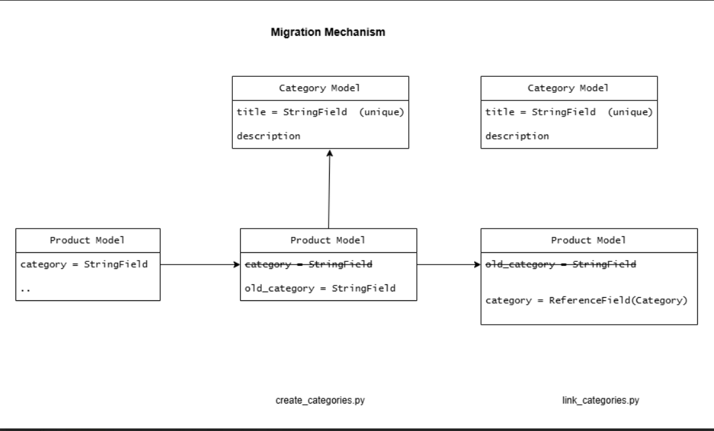

# Product API Documentation

This Product API is designed with a Repository, Service, and Controller layer architecture for **separation of concerns** and efficient product management. It supports **CRUD operations**, **pagination**, and **sorting**, utilizing `Product` and `ProductCategory` models integrated with **MongoDB**.

## Architecture Layers

- **Controller Layer:** Handles HTTP requests and responses (thin layer).  
- **Service Layer:** Contains business logic and interacts with the repository layer.  
- **Repository Layer:** Manages database interactions, handling read/write operations in MongoDB.  


## Product Model

The Product model defines the schema for storing product details in a MongoDB collection.

```python
class Product(Document):
    name = StringField(max_length=100, required=True)
    description = StringField()
    category = ReferenceField("ProductCategory", reverse_delete_rule=CASCADE)
    price = DecimalField(precision=2, required=True)
    brand = StringField(max_length=50)
    quantity = IntField(default=0, min_value=0)
    created_at = DateTimeField(default=lambda: datetime.now(timezone.utc))
    updated_at = DateTimeField(default=lambda: datetime.now(timezone.utc))
    
    meta = {"collection": "products_collection"}
```
## ProductCategory Model

```python
class ProductCategory(Document):
    title = StringField(max_length=200, unique=True, required=True)
    description = StringField()
    
    meta = {"collection": "product_categories_collection"}
```

## API Endpoints

### Products

| Endpoint               | HTTP Method | Description                                  |
|------------------------|-------------|----------------------------------------------|
| `/api/products/`       | GET         | Retrieve paginated, sortable product list    |
|                        | POST        | Create a new product                         |
| `/api/products/<id>/`  | GET         | Retrieve specific product details by ID      |
|                        | PUT         | Update specific product by ID                |
|                        | DELETE      | Delete specific product by ID                |


### Product Categories

| Endpoint               | HTTP Method | Description                                  |
|------------------------|-------------|----------------------------------------------|
| `GET /api/categories/`       | GET         | Retrieve paginated list of categories    |
|                        | POST        | Create a new category                         |
| `/api/categories/{cat_id}/`  | GET         | Retrieve specific category details by ID      |
|                        | PUT         | Update specific category by ID                |
|                        | DELETE      | Delete specific category by ID                |

## Features & Query Parameters

### Product Filtering

| Parameter   | Example                    | Description                                  |
|-------------|----------------------------|----------------------------------------------|
| `category`  | `?category={cat_id}`       | Filter products by category ID               |
| `name`      | `?name=laptop`             | Partial name match (case-insensitive)        |
| `brand`     | `?brand=dell`              | Filter by brand name (contains match)        |
| `min_price` | `?min_price=500`           | Products with price ≥ specified value        |
| `max_price` | `?max_price=2000`          | Products with price ≤ specified value        |

## Key Features

### Pagination
- Default: 2 items per page
- Customize with `page_size` parameter (e.g., `?page_size=5`)

### Sorting
- Sort by creation date: `?sort_by=created_at` (newest first)
- Sort by update date: `?sort_by=updated_at` (recently updated first)

## Migration Mechanism:
Introduced a migration mechanism to transition products from a string-based 
category field to a reference-based Category model.
 


## Migration Sequence
The migration process follows three steps to ensure clean and safe transition of data.

### 1. Create Categories
```python
python manage.py create_categories
```
Creates `ProductCategory` entries from unique category strings to enable model-based referencing.

### 2. Backup Old Category Field
```python
python manage.py copy_categories_to_old
```
Backs up the original category into `old_category` and removes the old `category` field to prepare for migration.

###  3. Link Categories
```python
python manage.py link_categories
```
Links products to `ProductCategory` using `old_category`, then cleans up the temporary field.

## Validation Rules

### Product Requirements
- Required fields: `name`, `price`, `brand`, `category`
  - `name`: String (max 100 characters)
  - `price`: Positive decimal value (2 decimal places)
  - `brand`: String (max 50 characters)
  - `category`: Must be a valid existing category ID (`{cat_id}`)
- `quantity`: Integer (minimum 0, default 0)

### Category Requirements
- `title`: Required string (unique, max 200 characters)
- Deletion: Not allowed if any products reference this category